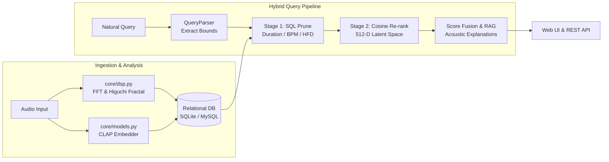

# reAudio

> Fractal-aware multimodal audio retrieval engine combining physical waveform analysis with zero-shot contrastive embeddings and relational SQL constraint filtering.

reAudio indexes audio libraries by coupling mathematical time-series fractal analysis with multimodal text-audio representations. It resolves natural language sound design intent into exact relational SQL constraints (duration, BPM, waveform roughness) followed by cosine semantic vector re-ranking.

---

## Architecture



---

## Core Capabilities

- **Mathematical Fractal Analysis**: Computes nonlinear waveform complexity using **Higuchi Fractal Dimension (HFD)**, Katz FD, and $1/f^\beta$ spectral slope. Transforms acoustic texture ("smooth harmonic" vs "distorted chaos") into a scalar filterable directly inside SQL queries.
- **Zero-Shot Multimodal Intelligence**: Employs **LAION CLAP** to map natural text descriptions and raw waveforms into a joint 512-dimensional metric space. Includes a deterministic fallback embedder for offline or resource-constrained environments.
- **Two-Stage Hybrid Retrieval**: Uses relational predicates (`WHERE duration <= 120 AND bpm >= 120`) to eliminate vector hallucinations on hard constraints, followed by cross-modal cosine similarity re-ranking ($70\%$ semantic + $30\%$ acoustic tolerance).
- **Explainable Match Diagnostics**: Derives deterministic, grounded match rationale based on retrieved physical parameters (spectral centroid, dynamic range, and fractal bounds).

---

## Quickstart

```bash
# 1. Install dependencies (Python 3.10+)
pip install -r requirements.txt

# 2. Generate and index synthetic demo library (8 procedural tracks)
python synthesize_demo_data.py --fallback

# 3. Launch the web application
python cli.py serve
# Open http://127.0.0.1:8000
```

---

## CLI & API Reference

### Command Line

```bash
# Ingest local audio file or folder
python cli.py ingest ./library --artist "Studio Name"

# Hybrid intent search
python cli.py search "terrifying cyberpunk boss fight under 2 minutes"

# Embedding-based track recommendations
python cli.py recommend iron_tyrant_boss --top-k 4

# Run test suite (52 unit tests)
pytest tests/ -v
```

### REST API

| Method | Endpoint | Description |
|---|---|---|
| `GET` | `/api/tracks` | Retrieve all indexed tracks with DSP features |
| `POST` | `/api/search` | Execute hybrid search with SQL filters and semantic re-ranking |
| `GET` | `/api/recommend/{id}` | Retrieve nearest-neighbor tracks in embedding space |
| `GET` | `/api/presets` | Fetch built-in game-audio archetype query presets |
| `GET` | `/api/audio/{id}` | Stream audio waveform |
| `POST` | `/api/upload` | Upload, compute DSP features, embed, and index on the fly |

---

## Repository Structure

```
reAudio/
├── cli.py                  # Command-line interface
├── config.py               # Application paths and settings
├── synthesize_demo_data.py # Procedural audio generator
├── core/
│   ├── dsp.py              # Higuchi FD, Katz FD, FFT spectral analysis
│   ├── database.py         # SQLAlchemy schemas and relational query filters
│   ├── models.py           # LAION CLAP wrapper and deterministic fallback
│   ├── retrieval.py        # Query parser, hybrid ranker, recommendations
│   └── explainer.py        # Grounded match rationale generator
├── web/
│   ├── app.py              # FastAPI service and static endpoints
│   └── static/             # Vanilla JS, CSS, and Web Audio API visualizer
├── data/sample_audio/      # Indexed library audio files
└── tests/                  # 52 unit and integration tests
```

---

## License

MIT
