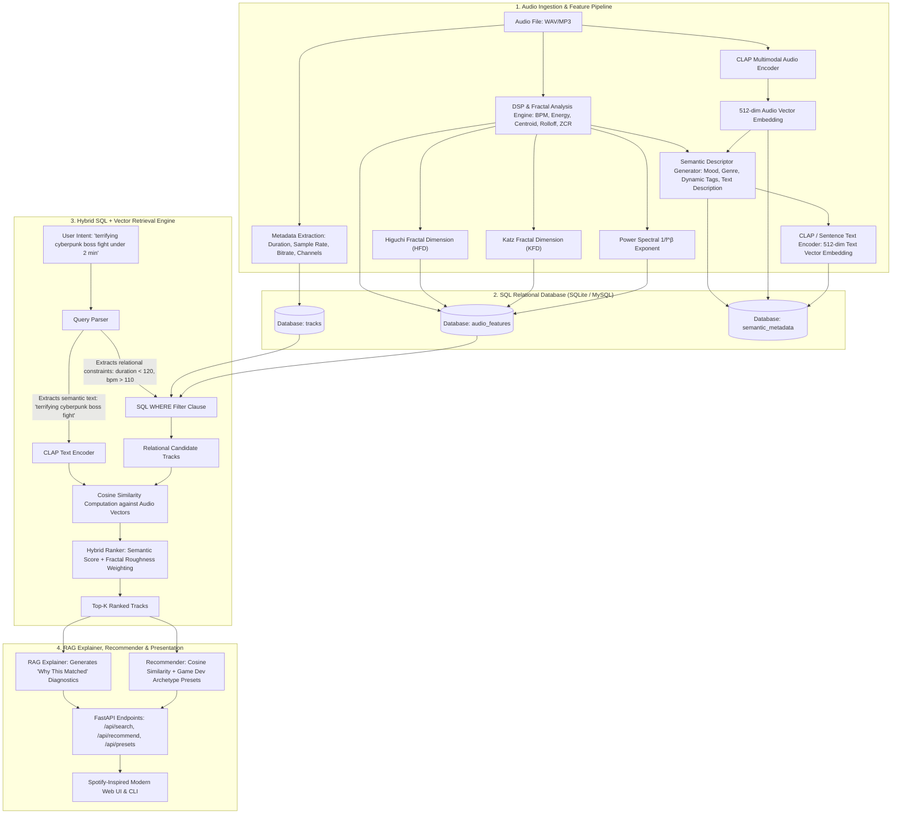

# AudioMind: Master Implementation Blueprint & Architecture Specification

**Target Location:** `D:\AudioMind`  
**Core Stack:** Python 3.10+, Librosa/DSP, Fractal Analysis (Higuchi & Katz FD, 1/f Spectral Exponent), Multimodal CLAP (Transformers/PyTorch), Relational SQL (SQLAlchemy + SQLite/MySQL), FastAPI, HTML5/CSS3/JavaScript (Spotify-inspired dark UI).

---

## 1. System Architecture & Block Diagram



---

## 2. Mathematical Foundations

### 2.1 Higuchi Fractal Dimension (HFD)
Measures the self-similarity and geometrical complexity of time-domain audio waveforms $X(1), X(2), \dots, X(N)$:
1. For time intervals $k \in \{1, \dots, k_{\max}\}$, construct $k$ sub-series $X_m^k$:
   $$X_m^k = \{ X(m), X(m+k), X(m+2k), \dots, X(m + \lfloor \frac{N-m}{k} \rfloor k) \}, \quad m = 1, 2, \dots, k$$
2. Compute the normalized length of each sub-series curve:
   $$L_m(k) = \frac{N-1}{\lfloor \frac{N-m}{k} \rfloor \cdot k} \frac{1}{k} \sum_{i=1}^{\lfloor \frac{N-m}{k} \rfloor} |X(m + ik) - X(m + (i-1)k)|$$
3. Average across all $m$:
   $$\langle L(k) \rangle = \frac{1}{k} \sum_{m=1}^k L_m(k)$$
4. Power-law relation:
   $$\langle L(k) \rangle \propto k^{-D}$$
   The Higuchi Fractal Dimension $D$ is the negative slope obtained by linear regression of $\ln \langle L(k) \rangle$ against $\ln(1/k)$.
5. **Physical Interpretation in Audio**:
   - $D \approx 1.05 - 1.25$: Pure tones, ambient pads, soft acoustic music (smooth, low chaos).
   - $D \approx 1.30 - 1.55$: Standard rock, pop, orchestral, electronic percussion.
   - $D \approx 1.60 - 1.90$: Distorted industrial metal, glitch beats, noise soundscapes, heavy boss fights (extreme jaggedness and acoustic roughness).

### 2.2 Katz Fractal Dimension (KFD)
$$D_{\text{Katz}} = \frac{\log_{10}(n)}{\log_{10}(n) + \log_{10}(d / L)}$$
where $L$ is the total Euclidean path length of the waveform, $d$ is the planar distance between the first point and the furthest point, and $n = L / \bar{a}$ (step count).

### 2.3 Fractal Spectral Exponent ($\beta$) & $1/f^\beta$ Noise
In acoustic signals, the Power Spectral Density $S(f)$ scales as:
$$S(f) \propto \frac{1}{f^\beta} \implies \log_{10}(S(f)) = -\beta \log_{10}(f) + C$$
- $\beta \approx 0$: White noise (equal energy per Hertz).
- $\beta \approx 1$: Pink noise (fractal music, natural acoustic equilibrium).
- $\beta \approx 2$: Brownian noise (deep sub-bass, atmospheric rumbling).

### 2.4 Multimodal Embedding Cosine Similarity
$$\text{CosineSim}(\mathbf{u}_{\text{text}}, \mathbf{v}_{\text{audio}}) = \frac{\mathbf{u} \cdot \mathbf{v}}{\|\mathbf{u}\|_2 \|\mathbf{v}\|_2}$$

---

## 3. Relational Database Schema (SQL)

```sql
CREATE TABLE tracks (
    track_id VARCHAR(64) PRIMARY KEY,
    title VARCHAR(255) NOT NULL,
    artist VARCHAR(255) NOT NULL,
    duration FLOAT NOT NULL,
    sample_rate INT NOT NULL,
    bitrate INT NOT NULL,
    channels INT NOT NULL,
    file_path VARCHAR(512) NOT NULL,
    created_at DATETIME DEFAULT CURRENT_TIMESTAMP
);

CREATE TABLE audio_features (
    track_id VARCHAR(64) PRIMARY KEY,
    bpm FLOAT NOT NULL,
    rms_energy FLOAT NOT NULL,
    spectral_centroid FLOAT NOT NULL,
    spectral_rolloff FLOAT NOT NULL,
    zero_crossing_rate FLOAT NOT NULL,
    dynamic_range_db FLOAT NOT NULL,
    higuchi_fractal_dimension FLOAT NOT NULL,
    katz_fractal_dimension FLOAT NOT NULL,
    spectral_fractal_beta FLOAT NOT NULL,
    FOREIGN KEY (track_id) REFERENCES tracks(track_id) ON DELETE CASCADE
);

CREATE TABLE semantic_metadata (
    track_id VARCHAR(64) PRIMARY KEY,
    primary_genre VARCHAR(100) NOT NULL,
    mood VARCHAR(100) NOT NULL,
    tags_json TEXT NOT NULL,
    generated_description TEXT NOT NULL,
    audio_embedding BLOB,
    text_embedding BLOB,
    FOREIGN KEY (track_id) REFERENCES tracks(track_id) ON DELETE CASCADE
);

-- Compound indexes for high-speed SQL filtering
CREATE INDEX idx_tracks_duration ON tracks(duration);
CREATE INDEX idx_features_bpm ON audio_features(bpm);
CREATE INDEX idx_features_hfd ON audio_features(higuchi_fractal_dimension);
CREATE INDEX idx_features_energy ON audio_features(rms_energy);
CREATE INDEX idx_semantic_genre ON semantic_metadata(primary_genre);
CREATE INDEX idx_semantic_mood ON semantic_metadata(mood);
```

---

## 4. File Structure Specification

```
D:\AudioMind\
├── AUDIO_MIND_MASTER_SPEC.md    # Master specification copy
├── requirements.txt             # Dependency declarations
├── config.py                    # Environment settings and paths
├── core/
│   ├── __init__.py
│   ├── dsp.py                   # DSP + Higuchi, Katz FD & 1/f spectral exponent
│   ├── models.py                # CLAP multimodal encoder & description generator
│   ├── database.py              # SQLAlchemy models, migrations, and SQL query builder
│   ├── retrieval.py             # Hybrid SQL + Vector Search & Recommender
│   └── explainer.py             # RAG explanation diagnostics engine
├── web/
│   ├── __init__.py
│   ├── app.py                   # FastAPI application & REST endpoints
│   └── static/
│       ├── index.html           # Modern Spotify-inspired interface
│       ├── styles.css           # Polished glassmorphism dark theme
│       └── app.js               # Reactive UI logic, audio player, canvas visualizer
├── cli.py                       # Command-line interface for indexing, searching & stats
├── synthesize_demo_data.py      # Procedural audio generator for 8 diverse game/media tracks
└── tests/
    ├── __init__.py
    ├── test_dsp.py              # Unit tests for DSP & fractal calculations
    ├── test_database.py         # Unit tests for SQL operations and filters
    └── test_retrieval.py        # Unit tests for hybrid search & ranking
```

---

## 5. Step-by-Step Implementation Steps (Phased Tasks)

### Phase 1: Environment & Directory Setup
1. Create directory structure in `D:\AudioMind`.
2. Generate `requirements.txt`:
   ```
   numpy>=1.24.0
   scipy>=1.10.0
   soundfile>=0.12.0
   librosa>=0.10.0
   torch>=2.0.0
   transformers>=4.30.0
   scikit-learn>=1.2.0
   sqlalchemy>=2.0.0
   pymysql>=1.1.0
   fastapi>=0.100.0
   uvicorn>=0.23.0
   pydantic>=2.0.0
   pytest>=7.0.0
   ```
3. Create `config.py`:
   - `BASE_DIR = Path(__file__).resolve().parent`
   - `DATA_DIR = BASE_DIR / "data"`
   - `AUDIO_DIR = DATA_DIR / "sample_audio"`
   - `DB_PATH = DATA_DIR / "audiomind.db"`
   - `DATABASE_URL = os.getenv("DATABASE_URL", f"sqlite:///{DB_PATH}")`
   - `CLAP_MODEL_NAME = "laion/clap-htsat-unfused"`

### Phase 2: Mathematical DSP & Fractal Analysis Engine (`core/dsp.py`)
Implement the following functions:
- `higuchi_fractal_dimension(signal: np.ndarray, k_max: int = 16) -> float`: Calculates Higuchi fractal dimension $D$.
- `katz_fractal_dimension(signal: np.ndarray) -> float`: Computes Katz fractal dimension.
- `spectral_fractal_exponent(signal: np.ndarray, sr: int) -> float`: Computes $\beta$ slope of power spectral density.
- `extract_dsp_features(audio_path: str) -> dict`:
  - Duration, sample rate, channels, bitrate.
  - BPM using `librosa.beat.beat_track`.
  - RMS Energy, Spectral Centroid, Spectral Rolloff, Zero-Crossing Rate, Dynamic Range (dB).
  - Higuchi FD, Katz FD, Spectral Beta.

### Phase 3: Relational Database & SQL Layer (`core/database.py`)
- Initialize SQLAlchemy engine and session factory.
- Declare `Track`, `AudioFeatures`, and `SemanticMetadata` ORM models.
- Implement helper methods:
  - `init_db()`: Creates tables and indexes.
  - `save_track(track_dict, features_dict, semantic_dict)`: Inserts/updates relational records.
  - `filter_tracks_sql(duration_max, duration_min, bpm_min, bpm_max, min_fractal_dim, max_fractal_dim, genre, mood, tag_keyword)`: Executes optimized SQL parameterized queries.
  - `get_all_tracks()`: Returns all stored records with full feature breakdown.

### Phase 4: Multimodal Audio Intelligence (CLAP) (`core/models.py`)
- Class `AudioIntelligenceModel`:
  - Loads `transformers.ClapModel` and `transformers.ClapProcessor`.
  - Include fallback mock/lightweight embedding extractor (using acoustic feature projection) for instant offline testing if model weights are not yet cached.
  - `embed_audio(audio_path: str) -> np.ndarray`: Produces 512-dim normalized vector.
  - `embed_text(text: str) -> np.ndarray`: Produces 512-dim normalized vector.
  - `generate_semantic_profile(dsp_features: dict, audio_embed: np.ndarray) -> dict`: Infers likely genre, mood, and descriptive tags.

### Phase 5: Hybrid Retrieval & RAG Explainer (`core/retrieval.py` & `core/explainer.py`)
- `QueryParser`: Parses text queries:
  - Detects "under X minutes" / "less than X s" $\implies$ `duration_max`.
  - Detects "fast tempo" / "slow tempo" / "X bpm" $\implies$ `bpm_min` / `bpm_max`.
  - Detects "rough", "chaotic", "harsh", "distorted" $\implies$ `min_fractal_dim = 1.55`.
  - Detects "smooth", "ambient", "calm", "relaxing" $\implies$ `max_fractal_dim = 1.25`.
- `HybridRetrievalEngine`:
  - Step 1: SQL Filter to retrieve valid candidate tracks matching hard constraints.
  - Step 2: Compute cosine similarity between query text embedding and candidate audio embeddings.
  - Step 3: Combine scores: $\text{FinalScore} = 0.75 \times \text{SemanticScore} + 0.25 \times \text{AcousticFit}$.
- `RAGExplainer`:
  - Generates detailed diagnostic explanation:
    - Match score percentage.
    - Semantic alignment explanation (CLAP matching).
    - Fractal texture commentary (Higuchi roughness evaluation).
    - DSP verification (BPM and frequency profile).
- `Recommender`:
  - `recommend_similar(track_id: str, top_k: int = 4)`: Finds nearest neighbors in vector space.
  - `get_game_dev_preset(preset_name: str)`: Pre-configured queries for *Main Menu, Exploration, Village, Dungeon, Boss Fight, Credits*.

### Phase 6: Procedural Demo Audio Generator (`synthesize_demo_data.py`)
- Generates 8 distinct WAV files using NumPy synthesis (sine waves, harmonic additives, frequency modulation, pink/brown noise, distortion clipping):
  1. `iron_tyrant_boss.wav`: Heavy distorted sub-bass, industrial percussion ($D \approx 1.7$, 130 BPM).
  2. `whispering_ruins_dungeon.wav`: Sub-bass rumble, eerie sparse minor chords, brown noise ($D \approx 1.25$, 75 BPM).
  3. `sunnyvale_village.wav`: Clean acoustic guitar-like pluck, major triad harmonics, pink noise ($D \approx 1.15$, 92 BPM).
  4. `neon_highway_synthwave.wav`: 124 BPM electronic kick, arpeggiated sawtooth bassline ($D \approx 1.45$).
  5. `cosmic_sanctuary_menu.wav`: Celestial pads, slow ethereal sweeps ($D \approx 1.10$, 65 BPM).
  6. `glitch_overlord_combat.wav`: Rapid stutter transients, bitcrushed noise ($D \approx 1.82$, 155 BPM).
  7. `tavern_hearth_folk.wav`: Warm organic woodwind and string harmonics ($D \approx 1.20$, 105 BPM).
  8. `starlight_horizon_credits.wav`: Emotional piano progression and strings ($D \approx 1.18$, 80 BPM).
- Runs ingestion pipeline to populate `audiomind.db`.

### Phase 7: Web Interface & API (`web/app.py`, `web/static/*`)
- FastAPI REST endpoints:
  - `GET /api/tracks`: List all indexed tracks.
  - `POST /api/search`: Request body `{ "query": str, "duration_max": float, "bpm_min": float, ... }`. Returns ranked results + RAG explanation.
  - `GET /api/recommend/{track_id}`: Returns similar tracks.
  - `GET /api/presets`: Returns available game developer archetype presets.
  - `GET /api/audio/{track_id}`: Streams the audio file.
- Frontend:
  - Spotify-inspired dark UI (`#121212` background, vibrant accent `#1DB954` / `#00F2FE` cyan).
  - Search input with intent autocomplete.
  - Game Developer Preset tags.
  - Track cards with live playback, animated audio waveform, and expandable "Why This Matched" RAG breakdown displaying Higuchi Fractal Dimension, BPM, and Semantic similarity.

### Phase 8: CLI Interface & Automated Unit Tests
- `cli.py`:
  - `python cli.py ingest <folder_or_file>`
  - `python cli.py search "creepy boss battle under 2 minutes"`
  - `python cli.py recommend <track_id>`
  - `python cli.py stats`
- Unit tests (`tests/test_dsp.py`, `tests/test_database.py`, `tests/test_retrieval.py`):
  - Check Higuchi Fractal Dimension returns expected bounds ($1.0 \le D \le 2.0$).
  - Check database insertions, relational queries, and filters.
  - Check hybrid retrieval scoring.
